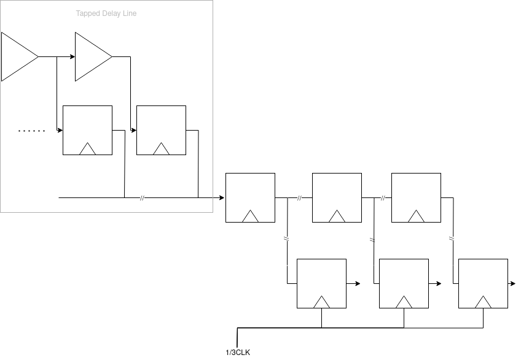
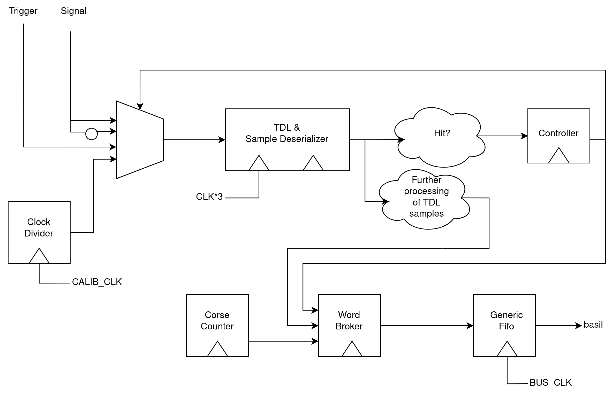

==========================================================================
**Tdl Tdc** - Tapped Delay Line based Time to Digital Converter
==========================================================================

----------------
Required modules
----------------

* `utils/3_stage_synchronizer.v`
* `utils/flag_domain_crossing.v`
* `utils/generic_fifo.v`
* `utils/cdc_syncfifo.v`
* `utils/clock_divider.v`

----------------
Key TDC figures
----------------

* 30ps RMS accuracy
* 40ns shortest reliably detectable pulse length
* 400us dynamic range

----------------
Usage
----------------
Before every experiment, the Tdc should be calibrated, ideally after it had time running to warm up. This can be done as follows::

        chip['TDL_TDC'].EN_CALIBRATION_MOD = 1
        time.sleep(1)
        chip['TDL_TDC'].EN_CALIBRATION_MOD = 0

 

This will cause the Tdc to write many ``CALIB`` words to the fifo. Subsequently any required configuration bits for the particular experiment may be set. During analysis the recorded
calibration stream is easily incorporated::
        
        calib_data_indices = chip['TDL_TDC'].is_calib_word(collected_data)

        if any(calib_data_indices) :
            calib_values = chip['TDL_TDC'].get_raw_tdl_values(np.array(collected_data[calib_data_indices]))
            chip['TDL_TDC'].set_calib_values(calib_values)
            logging.info("Calibration set using %s samples" % len(calib_values))

Optionally, you can view a histogram of the calibration using ``chip['TDL_TDC'].plot_calib_values(calib_values)``.

        If measurements are made over a longer time span, recalibration might be necessary, however note that the above example lumps all the calibration(s) in ``collected_data`` together.

The calibrated basil module can then be used the following way::
        
        time_word_indices = chip['TDL_TDC'].is_time_word(collected_data)
        time_data = collected_data[time_word_indices]
        if any(calib_data_indices) :
                time_in_ns = chip['TDL_TDC'].tdc_word_to_time(time_data[0])

----------------
Test module
----------------

Under ``examples/tdc_bdaq`` you can find an example implementation of the module along side a sequence generator to generate test signals. The TDC uses the external Si570 oscillator while the signal generator uses the external Si550. The script generates pulses of varying trigger distance and creates a plot of the difference of measured and expected time values, alongside errorbars of the standard deviation.

----------------
Data Format
----------------
The Tdc module uses a state machine to send various types of 32 bit data words, however the first seven bits always follow the same structure:

+-------------------------+-------------------+---------------------------------------------------------+
| DATA IDENTIFIER (4 bit) | WORD TYPE (3 bit) |                     Data (25 bits)                      |
+-------------------------+-------------------+---------------------------------------------------------+

The three bit codes for the individual word types can be found in `word_broker.v <https://github.com/SiLab-Bonn/basil/blob/tdl_tdc/basil/firmware/modules/tdl_tdc/word_broker.v>`_, but the basil driver can decode these without manual effort. The words containing the tdc information are in the following order::
        
        [TRIGGERED] -> RISING -> FALLING -> [TIMESTAMP]

``TRIGGERED`` is only sent if ``EN_TRIGGER_DIST``, and ``TIMESTAMP`` only if ``EN_WRITE_TIMESTAMP`` is set. Note however, that this sequence can be interrupted and appear incomplete, for example if the module is reset during a measurement.

In the following, we list how the remaining 25 bits are allocated for the various words.

^^^^^^^^^^^^^^^^^^^^^^^^^^^^^^^^
TRIGGERED, RISING, FALLING
^^^^^^^^^^^^^^^^^^^^^^^^^^^^^^^^

+---------------------------------------------+---------------------------+-----------------------------+
|          160 Mhz Counter (16 bits)          |  480 Mhz Counter (2 bits) |      Delay Line (7 bits)    |
+---------------------------------------------+---------------------------+-----------------------------+

^^^^^^^^^^^^^^^^^^^^^^^^^^^^^^^^
TIMESTAMP
^^^^^^^^^^^^^^^^^^^^^^^^^^^^^^^^
This word comes after the ``FALLING`` word, but the Timestamp is actually sampled two 160Mhz clock cycles after a measurement has been started.

+-------------------------------------------------------------------+-----------------------------------+
|                           Timestamp (16 bits)                     |               0 (9 bits)          |
+-------------------------------------------------------------------+-----------------------------------+

^^^^^^^^^^^^^^^^^^^^^^^^^^^^^^^^
CALIB
^^^^^^^^^^^^^^^^^^^^^^^^^^^^^^^^
If the Tdc is set for self-calibration using ``EN_CALIBRATION_MODE``, it will repeatedly send this word.

+---------------------------------------------+---------------------------+-----------------------------+
|          0 (16 bits)                        |  480 Mhz Counter (2 bits) |      Delay Line (7 bits)    |
+---------------------------------------------+---------------------------+-----------------------------+

^^^^^^^^^^^^^^^^^^^^^^^^^^^^^^^^
RESET
^^^^^^^^^^^^^^^^^^^^^^^^^^^^^^^^
If a reset is issued to the Tdc, either as a global bus reset or through basil, this word is sent. It might be useful for resetting a state machine
decoding the words on the receiving end. The Timestamp included is sampled as soon as 
the reset signal has passed the clock domain crossing circuitry.

+-------------------------------------------------------------------+-----------------------------------+
|                           Timestamp (16 bits)                     |               0 (9 bits)          |
+-------------------------------------------------------------------+-----------------------------------+

----------------
Architecture
----------------

The TDC is built around the delay line found in the `Link jTDC <https://github.com/jobisoft/jTDC>`_ which uses about 200 delay elements of which only every second is sampled. This is done because the bin size variance is very large so that if every tap is used, hardly more precision will be obtained. However, this relatively long delay line can be sampled with a lower rate without missing signals. Implementations using every tap usually use several delay lines of about 100 elements which are then sampled using different clock phases. One such implementation can be found in the `Link master thesis <https://github.com/benbr8/tdc-fpga>`_ of Benjamin Blase, which will also give interesting insights to TDC architecture considerations. The priority encoder of this TDC, i.e. the module converting the delay line thermometer code to binary, is based on his work.

In order to sample the delay elements at a high enough rate while still being able to process them, we use a 3x multisampling approach: There is a shift register shifting in the entire information of the delay line using the 3x clock and at every slow clock tick the contents of the shift register are copied for further processing in the slow clock domain. Only then do we detect signal transitions and convert the thermometer code to binary.

The most distinct design choice in this implementation is that it uses only a single delay line for measuring rising and falling edges of two inputs. As rising and falling edges propagate delay elements differently it makes sense to treat with distinct calibrations or even separate delay lines. To circumvent this additional space requirement and complexity, we use a multiplexer co-ordinating which input, in which polarity, gets seen by the delay elements. This induces a lower bound on width of pulses we can measure as this input multiplexer needs some time to switch between signals. To drive the multiplexer we use a simple state machine, which also drives the word output generation in the ``word_broker`` module.

