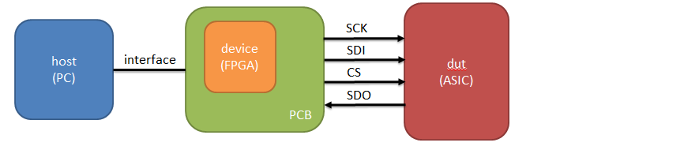
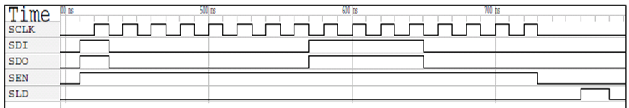

############
Examples
############

Example of project can be found in `examples folder <https://github.com/SiLab-Bonn/basil/tree/master/examples>`_.

For more usecases check also `tests folder <https://github.com/SiLab-Bonn/basil/tree/master/tests>`_.

spi
-------

An example shows how to create a simple spi interface.

Instantiate a verilog spi module in the firmware verilog code.

.. code-block:: verilog

    localparam SPI_BASEADDR = 32'h1000; 
    localparam SPI_HIGHADDR = 32'h1FFF;  

    spi 
    #( 
        .BASEADDR(SPI_BASEADDR), 
        .HIGHADDR(SPI_HIGHADDR),
        .MEM_BYTES(4) 
    )  i_spi
    (
        .BUS_CLK(BUS_CLK),
        .BUS_RST(BUS_RST),
        .BUS_ADD(BUS_ADD),
        .BUS_DATA(BUS_DATA),
        .BUS_RD(BUS_RD),
        .BUS_WR(BUS_WR),

        .SPI_CLK(SPI_CLK),

        .SCLK(SCLK),
        .SDI(SDI),
        .SDO(SDO),
        .SEN(SEN),
        .SLD(SLD)
    );

Create a configuration file.

.. code-block:: yaml

    transfer_layer:
      - name  : intf
        type  : SiSim

    hw_drivers:
      - name      : spi
        type      : spi
        interface : intf
        base_addr : 0x1000
        mem_bytes : 2

      - name        : CNT
        type        : StdRegister
        hw_driver   : spi
        size        : 16
        fields:
          - name    : EN
            size    : 1
            offset  : 15
          - name    : OUT
            size    : 15
            offset  : 14

Write control program.

.. code-block:: python

    dut = Dut('spi.yaml')
    dut.init()

    dut['CNT']['EN'] = 1
    dut['CNT']['OUT'] = 0x00f0
    dut['CNT'].write()
    dut['CNT'].start()

    while not dut['CNT'].is_done():
        pass

Result of simulation:

A workin example can be seen in tests/test_SimSpi.py.

gpio
-------

TBD.

