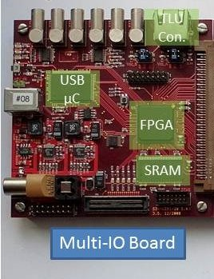
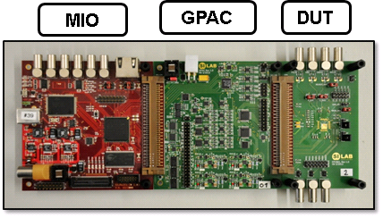

############
Hardware
############

Basil also allows easy integration with custom Hardware.

For our purpuse we developed general purpose hardware components which connect to custom DUTs. The MultiIO board (MIO) implements the main FPGA for digital IO, memory ressources, and the interface (USB 2.0) to the PC. To add analog functionality, the Gerneral Purpose Analog Card (GPAC) was developed. It connects to the MultiIO board and provides 4 programmable power supplies, 12 current sources, 4 voltage sources, 4 fast ADC channels, digital IO with scalable voltages, LVDS, and a programmable injection pulse generator. The device under test (DUT) will be connected with a custom PCB to the MIO/GPAC hardware.

 - MultiIO - Digital IO card with FPGA and USB 2.0 interface
 - MIO3 - Digital IO card with FPGA and USB 3.0 interface based on Enclustra `KX1 <http://www.enclustra.com/en/products/fpga-modules/mercury-kx1/>`_ module
 - GPAC - General Purpose Analog Card

MIO (Multi IO Card)
======================== 

The "S3 Multi IO System" is developed as an easy to use multi purpose digital IO card. It includes a free programmable Xilinx Spartan3 FPGA, SRAM Memory, USB2.0 Interface and a 8051 microcontroller with I2C and SPI functionality. It is designed to provide sufficient digital IO capability to any kind of daughter card. 

Features:
  Silicon devices
    - Xilinx Spartan3 FPGA - XC3S1000 FG320 4C
    - Cypress USB Controller - CY7C68013A 128AXC
    - Cypress async. SRAM - CY7C1061AV33 10ZXC
    - Programmable clock generator - Cypress CY22150

  IO connections
    - USB2.0 B-type as host interface
    - Multi-IO-Connector with 80 user IO´s (VccIO 1:2 V to 3:3 V)
    - Agilent debug connector (1253-3620)
    - JTAG connection
    - RJ-45 connector for 2 LVDS transmitter and 2 LVDS receiver
    - Header with I2C and SPI functionality
    - Header with additional FPGA user IO´s
    - 3 buffered LVTTL outputs with LEMO
    - 3 buffered LVTTL inputs with LEMO

  Power supply
    - via external 5V supply
    - via USB cable

  Configuration capability
    - via JTAG
    - via USB2.0

`Documentation for MIO card. <https://silab-redmine.physik.uni-bonn.de/documents/5>`_

GPAC (General Purpose Analog Card)
===================================

GPAC Card is developed as an easy to use multi purpose analog IO card compatible with MIO Card. 

Features:
  - 4 regulated power supples, 0.8-1.83/2.83 V, max. 1000 mA,  (controlled by I2C) 
  - 4 RX and 4 TX LVDS Lines
  - 4 channel ADC, 25MS, 14bit
  - 16 CMOS Outputs
  - 8 CMOS Inouts
  - 12 current source/sink, -1mA to +1mA, 12bit  (controlled by I2C) 
  - 4 voltage outputs, 0-2.048 V, 12bit (controlled by I2C) 
  - 64x (4 available to DUT) channel slow ADC for monitoring (controlled by I2C) 
  - Injection Pulse Generator with programmable voltage levels (high and low)

`Documentation for GPAC card. <https://silab-redmine.physik.uni-bonn.de/documents/6>`_ 

MIO3 (Multi IO Card USB3)
==========================

TBD.

LX9
==========================

`LX9 Board. <http://www.em.avnet.com/en-us/design/drc/Pages/Xilinx-Spartan-6-FPGA-LX9-MicroBoard.aspx>`_ 

**4 channel FE-I4 adepter with TLU:**

    .. image:: _static/lx9_fei4_a.jpg
    .. image:: _static/lx9_fei4_b.jpg
