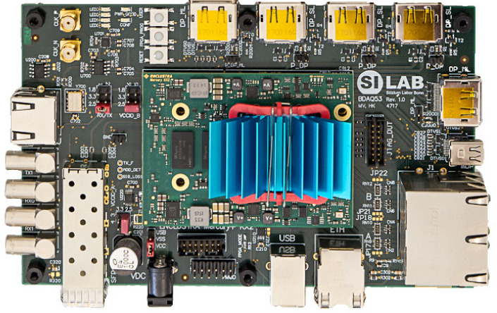
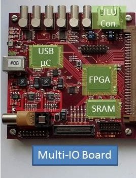
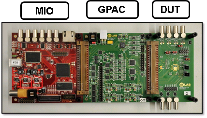

############
Hardware
############

Basil supports integration with several custom hardware platforms developed at SiLab for connecting to devices under test (DUTs). Each board provides FPGA-based digital IO with a host PC interface, and can be paired with analog front-end cards or custom DUT carrier boards.

 - **BDAQ53** -- Gigabit Ethernet readout board with Enclustra Mercury KX1/KX2 FPGA modules and SiTCP
 - **MIO** (MultiIO) -- Digital IO card with Xilinx Spartan-3 FPGA and USB 2.0 interface
 - **MIO3** (MultiIO USB3) -- Digital IO card based on Enclustra `KX1 <http://www.enclustra.com/en/products/fpga-modules/mercury-kx1/>`_ module with USB 3.0 interface
 - **GPAC** (General Purpose Analog Card) -- Analog front-end for MIO, with power supplies, current sources, ADCs, and injection pulse generator
 - **LX9** -- Xilinx Spartan-6 LX9 MicroBoard adapter

BDAQ53
==========================

The BDAQ53 is a readout board developed at SiLab, intended as a lab test system for characterization, irradiation, and testbeam setups, as well as other supervised measurements. The software part of the readout system is written in Python and meant to be easily understandable and modifiable.

Originally designed for the RD53 collaboration, serving the ATLAS ITkPix chip family, the BDAQ53 has since been adopted by a number of other projects at SiLab, including the `TJ-Monopix2 <https://github.com/SiLab-Bonn/tj-monopix2-daq>`_ depleted monolithic pixel sensor, `LF-Monopix2 <https://github.com/SiLab-Bonn/lf-monopix2-daq>`_, the Belle II DEPFET upgrade, and the `FRIDA <https://github.com/kcaisley/frida>`_ ADC test chip.

The board accepts Enclustra Mercury FPGA modules, either the `KX1 <https://www.enclustra.com/en/products/fpga-modules/mercury-kx1/>`_ (speed grade -1) or `KX2 <https://www.enclustra.com/en/products/fpga-modules/mercury-kx2/>`_, which plug into the top of the board via high-density connectors. Both carry a Xilinx Kintex-7 XC7K160T FPGA. Communication with the host PC is over Gigabit Ethernet using `SiTCP <https://www.sitcp.net/>`_, a TCP/IP stack implemented directly in FPGA fabric.

Around the edges of the board, five DisplayPort connectors (DP1 to DP5) provide high-density differential IO for connecting to custom DUT carrier boards. Four RJ45 connectors offer additional single-ended or differential pairs. A standard PMOD header exposes eight general-purpose signal pins (plus power and ground) for debug probing with a logic analyzer or oscilloscope. The board is powered by an external 5V supply and programmed via JTAG using a Xilinx Platform Cable.

More information can be found in the `BDAQ53 wiki <https://gitlab.cern.ch/silab/bdaq53/-/wikis/home>`_ as well as the `BDAQ53 paper <https://doi.org/10.1016/j.nima.2020.164721>`_ (NIM A, 2020).

MIO (Multi IO Card)
========================

The "S3 Multi IO System" is developed as an easy to use multi purpose digital IO card. It includes a free programmable Xilinx Spartan3 FPGA, SRAM Memory, USB2.0 Interface and a 8051 microcontroller with I2C and SPI functionality. It is designed to provide sufficient digital IO capability to any kind of daughter card.

Features:
  Silicon devices
    - Xilinx Spartan3 FPGA - XC3S1000 FG320 4C
    - Cypress USB Controller - CY7C68013A 128AXC
    - Cypress async. SRAM - CY7C1061AV33 10ZXC
    - Programmable clock generator - Cypress CY22150

  IO connections
    - USB2.0 B-type as host interface
    - Multi-IO-Connector with 80 user IO´s (VccIO 1:2 V to 3:3 V)
    - Agilent debug connector (1253-3620)
    - JTAG connection
    - RJ-45 connector for 2 LVDS transmitter and 2 LVDS receiver
    - Header with I2C and SPI functionality
    - Header with additional FPGA user IO´s
    - 3 buffered LVTTL outputs with LEMO
    - 3 buffered LVTTL inputs with LEMO

  Power supply
    - via external 5V supply
    - via USB cable

  Configuration capability
    - via JTAG
    - via USB2.0

`Documentation for MIO card. <https://silab-redmine.physik.uni-bonn.de/documents/5>`_

GPAC (General Purpose Analog Card)
===================================

GPAC Card is developed as an easy to use multi purpose analog IO card compatible with MIO Card.

Features:
  - 4 regulated power supples, 0.8-1.83/2.83 V, max. 1000 mA,  (controlled by I2C)
  - 4 RX and 4 TX LVDS Lines
  - 4 channel ADC, 25MS, 14bit
  - 16 CMOS Outputs
  - 8 CMOS Inouts
  - 12 current source/sink, -1mA to +1mA, 12bit  (controlled by I2C)
  - 4 voltage outputs, 0-2.048 V, 12bit (controlled by I2C)
  - 64x (4 available to DUT) channel slow ADC for monitoring (controlled by I2C)
  - Injection Pulse Generator with programmable voltage levels (high and low)

`Documentation for GPAC card. <https://silab-redmine.physik.uni-bonn.de/documents/6>`_

MIO3 (Multi IO Card USB3)
==========================

TBD.

LX9
==========================

`LX9 Board. <http://www.em.avnet.com/en-us/design/drc/Pages/Xilinx-Spartan-6-FPGA-LX9-MicroBoard.aspx>`_

**4 channel FE-I4 adepter with TLU:**

    .. image:: _static/lx9_fei4_a.jpg
    .. image:: _static/lx9_fei4_b.jpg
