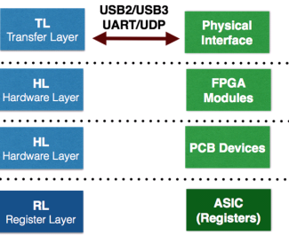

############
Software
############

The software framework has a modular structure that reflects the firmware and adds extra layers to make hardware interface user friendly. It loosely follows Register Abstract Layer (RAL) concepts. All the layers are automatically created based on yaml configuration file. 

Yaml configuration file
=======================

TBD

Transfer Layer (TL)
====================

Implements communication interface like UART, USB, Ethernet or Simulation.
Every TL interface implements 2 functions:

.. automodule:: basil.TL.TransferLayer

.. autoclass:: TransferLayer
    :members:

Hardware Layer (HL)
====================

Implements drivers for basil modules and external devices. Drivers can reference other drivers within HL.

Register Layer (RL)
===================

Implements Register Level Abstraction. Allow to user/control software to work on DUT registers without taking thinking about underlying levels.

