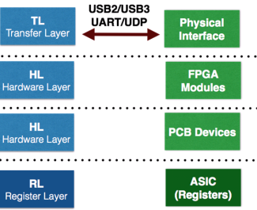

############
Software
############

The software framework has a modular structure that reflects the firmware and adds extra layers to make hardware interface user friendly. It loosely follows Register Abstract Layer (RAL) concepts. All the layers are automatically created based on a YAML configuration file.

.. note::

    The diagram shows USB as the physical interface, but TCP/IP (via Ethernet and SiTCP) is now the more common choice for new designs. Both are supported.

The ``Dut`` class parses a YAML configuration file and instantiates all modules in order: transfer layer first, then hardware drivers, then registers. Each entry has a ``name`` and a ``type`` that maps to a Python class in the corresponding layer package.

Transfer Layer (TL)
====================

Implements communication interfaces. Each entry in the ``transfer_layer`` list defines a connection to hardware.

.. code-block:: yaml

    transfer_layer:
      - name: intf
        type: SiTcp
        init:
          ip: 192.168.10.16
          udp_port: 4660
          tcp_port: 24

Available types (see `basil/TL/ <https://github.com/SiLab-Bonn/basil/tree/master/basil/TL>`_):

- ``SiTcp`` -- Ethernet via SiTCP
- ``SiUsb`` / ``SiUsb3`` -- USB 2.0/3.0
- ``Serial`` -- RS-232 / USB-serial
- ``Visa`` -- PyVISA for GPIB/USB/serial instruments
- ``Socket`` -- Raw TCP socket
- ``SiSim`` -- Simulation interface (`cocotb <https://github.com/cocotb/cocotb>`_)

.. automodule:: basil.TL.TransferLayer

.. autoclass:: TransferLayer
    :members:

Hardware Layer (HL)
====================

Implements drivers for FPGA firmware modules and external lab devices. Each entry in the ``hw_drivers`` list references a transfer layer by name via ``interface``, and FPGA modules are addressed via ``base_addr``.

.. code-block:: yaml

    hw_drivers:
      - name: gpio
        type: gpio
        interface: intf
        base_addr: 0x30000
        size: 8

      - name: spi
        type: spi
        interface: intf
        base_addr: 0x20000

      - name: seq
        type: seq_gen
        interface: intf
        base_addr: 0x10000
        mem_size: 8192

Available FPGA module types are documented in detail on the :doc:`modules` page. Basil also includes drivers for a wide range of lab instruments, including power supplies, electrometers, oscilloscopes, function generators, climate chambers, chillers, mass flow controllers, temperature/humidity sensors, wafer probers, and Arduino-based peripherals. The full set of drivers can be found in `basil/HL/ <https://github.com/SiLab-Bonn/basil/tree/master/basil/HL>`_.

.. automodule:: basil.HL.HardwareLayer

.. autoclass:: HardwareLayer
    :members:

Register Layer (RL)
===================

Implements Register Level Abstraction. Allows user/control software to work on DUT registers without thinking about underlying levels. Each entry in the ``registers`` list references a hardware driver by name.

.. code-block:: yaml

    registers:
      - name: SEQ
        type: TrackRegister
        hw_driver: seq
        seq_width: 8
        seq_size: 8192
        tracks:
          - name: CLK_INIT
            position: 0
          - name: CLK_SAMP
            position: 1

Available types (see `basil/RL/ <https://github.com/SiLab-Bonn/basil/tree/master/basil/RL>`_):

- ``StdRegister`` -- Standard bit-field register
- ``TrackRegister`` -- Sequencer track register
- ``FunctionalRegister`` -- Functional register

.. automodule:: basil.RL.RegisterLayer

.. autoclass:: RegisterLayer
    :members:
